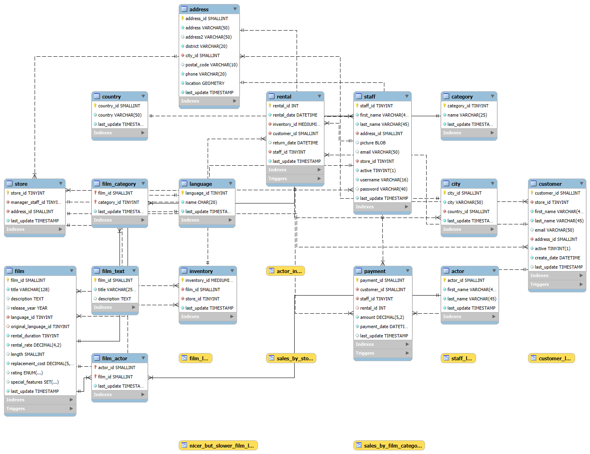

```{r setup, include=FALSE}
knitr::opts_chunk$set(
  echo      = TRUE,
  message   = FALSE,
  warning   = FALSE,
  fig.align = "center",
  fig.width  = 9,
  fig.height = 5.5
)
```

---

# Pendahuluan 

## Deskripsi Dataset

<div class="callout-box">
**Database Sakila** adalah contoh database relasional yang dikembangkan oleh MySQL untuk keperluan pembelajaran. Database ini mensimulasikan sistem manajemen penyewaan film (*DVD rental store*) dan terdiri dari **16 tabel** yang saling berelasi.
</div>

## Struktur Database (ERD)

Gambar ERD (Entity Diagram Relationship) pada database sakila

<a href="images/Sakila_ERD_Diag.png" target="_blank">
  
</a>
<p style="text-align: center; font-size: 0.8em;"><i>Gambar 1. Entity Relationship Diagram (ERD) Database Sakila. Klik gambar untuk membuka di tab baru</i></p>

## Insight yang Diangkat

<div class="callout-box success">
**Insight Utama:** *Bagaimana performa bisnis Sakila ditinjau dari profitabilitas aktor (Actor ROI), distribusi geografis pendapatan di pasar global (Market Concentration), serta segmentasi loyalitas pelanggan menggunakan analisis RFM (Recency, Frequency, Monetary)?*
*Analisis ini bertujuan untuk:*

*1.  Mengidentifikasi aktor yang memberikan imbal hasil (revenue) tertinggi bagi perusahaan.*

*2.  Memetakan konsentrasi pasar di berbagai negara untuk melihat wilayah yang paling potensial.*

*3.  Mengategorikan pelanggan ke dalam segmen loyalitas guna membedakan pelanggan setia (champions) dari pelanggan yang berisiko berhenti berlangganan (churn risk).*
</div>

### Tabel-tabel Utama yang Digunakan

| Tabel | Deskripsi | Kolom Kunci |
|-------|-----------|-------------|
| `rental` | Transaksi sewa film (Untuk Recency & Frequency) | `rental_id`, `rental_date`, `customer_id`, `inventory_id` |
| `payment` | Pembayaran pelanggan (Untuk Monetary) | `payment_id`, `amount`, `payment_date`, `customer_id` |
| `actor` | Profil aktor pemeran dalam film | `actor_id`, `first_name`, `last_name` |
| `film_actor` | Tabel penghubung antara aktor dengan film | `actor_id`, `film_id` |
| `customer` | Data pelanggan | `customer_id`, `address_id` |
| `address`, `city`, `country` | Data hierarki lokasi | `address_id`, `city_id`, `country_id` |

---

# Persiapan Data

## Library

```{r libraries, message=FALSE, warning=FALSE}
# Library utama
library(odbc)
library(DBI)
library(tidyverse)
library(scales)
library(knitr)
library(kableExtra)
library(treemapify)
```

## Koneksi ke Database

```{r connection, message=FALSE, warning=FALSE}
# Melakukan koneksi
con <- DBI::dbConnect(odbc::odbc(),
  Driver = "MySQL ODBC 8.0 ANSI Driver",
  Server = "127.0.0.1",
  Database = "sakila",
  UID = "root",
  PWD = "nfp002556()-#$",
  Port = 3306
)

```

---

# Query SQL

## Actor ROI (Return on Investment)

```{sql actor_roi,connection=con}
SELECT
    a.actor_id,
    CONCAT(a.first_name, ' ', a.last_name)   AS nama_aktor,
    COUNT(DISTINCT fa.film_id)                AS jumlah_film,
    COUNT(r.rental_id)                        AS jumlah_rental,
    ROUND(SUM(p.amount), 2)                   AS total_revenue,
    ROUND(SUM(p.amount) / COUNT(DISTINCT fa.film_id), 2)
                                              AS revenue_per_film
FROM actor        a
JOIN film_actor   fa ON a.actor_id      = fa.actor_id
JOIN film          f ON fa.film_id      = f.film_id
JOIN inventory     i ON f.film_id       = i.film_id
JOIN rental        r ON i.inventory_id  = r.inventory_id
JOIN payment       p ON r.rental_id     = p.rental_id
GROUP BY a.actor_id, a.first_name, a.last_name
ORDER BY total_revenue DESC
LIMIT 20;
```

## Market Concentration

```{sql market_concentration, connection=con}
SELECT
    co.country,
    COUNT(DISTINCT cu.customer_id)            AS customer_count,
    COUNT(r.rental_id)                        AS total_rental,
    ROUND(SUM(p.amount), 2)                   AS total_revenue,
    ROUND(SUM(p.amount) / COUNT(DISTINCT cu.customer_id), 2)  AS avg_per_cust
FROM country   co
JOIN city      ci ON co.country_id    = ci.country_id
JOIN address   ad ON ci.city_id       = ad.city_id
JOIN customer  cu ON ad.address_id    = cu.address_id
JOIN rental    r  ON cu.customer_id   = r.customer_id
JOIN payment   p  ON r.rental_id      = p.rental_id
GROUP BY co.country
ORDER BY total_revenue DESC
LIMIT 20;
```

## RFM Segmentation

```{sql rfm_segment, connection=con}
SELECT
    cu.customer_id,
    DATEDIFF('2006-02-15', MAX(r.rental_date))   AS recency,
    COUNT(r.rental_id)                            AS frequency,
    ROUND(SUM(p.amount), 2)                       AS monetary
FROM customer  cu
JOIN rental    r ON cu.customer_id = r.customer_id
JOIN payment   p ON r.rental_id    = p.rental_id
GROUP BY cu.customer_id;
```

```{r include=FALSE}
# ── Jalankan query nyata dari R ────────────────────────────────
df_actor_roi <- dbGetQuery(con, "
  SELECT a.actor_id,
         CONCAT(a.first_name,' ',a.last_name) AS nama_aktor,
         COUNT(DISTINCT fa.film_id)            AS jumlah_film,
         COUNT(r.rental_id)                    AS jumlah_rental,
         ROUND(SUM(p.amount),2)                AS total_revenue,
         ROUND(SUM(p.amount)/COUNT(DISTINCT fa.film_id),2) AS revenue_per_film
  FROM actor a
  JOIN film_actor fa ON a.actor_id=fa.actor_id
  JOIN film f ON fa.film_id=f.film_id
  JOIN inventory i ON f.film_id=i.film_id
  JOIN rental r ON i.inventory_id=r.inventory_id
  JOIN payment p ON r.rental_id=p.rental_id
  GROUP BY a.actor_id,a.first_name,a.last_name
  ORDER BY total_revenue DESC LIMIT 20")

df_market <- dbGetQuery(con, "
  SELECT co.country,
         COUNT(DISTINCT cu.customer_id) AS customer_count,
         COUNT(r.rental_id) AS total_rental,
         ROUND(SUM(p.amount),2) AS total_revenue,
         ROUND(SUM(p.amount)/COUNT(DISTINCT cu.customer_id),2) AS avg_per_cust
  FROM country co
  JOIN city ci ON co.country_id=ci.country_id
  JOIN address ad ON ci.city_id=ad.city_id
  JOIN customer cu ON ad.address_id=cu.address_id
  JOIN rental r ON cu.customer_id=r.customer_id
  JOIN payment p ON r.rental_id=p.rental_id
  GROUP BY co.country ORDER BY total_revenue DESC LIMIT 20")

df_rfm_base <- dbGetQuery(con, "
  SELECT cu.customer_id,
         DATEDIFF('2006-02-15', MAX(r.rental_date)) AS recency,
         COUNT(r.rental_id)    AS frequency,
         ROUND(SUM(p.amount),2) AS monetary
  FROM customer cu
  JOIN rental r ON cu.customer_id=r.customer_id
  JOIN payment p ON r.rental_id=p.rental_id
  GROUP BY cu.customer_id")

dbDisconnect(con)

# Hitung skor & segmen RFM di R
tanggal_ref <- as.Date("2006-02-15")
df_rfm_raw <- df_rfm_base %>%
  mutate(
    R_score = ntile(-recency,  5),
    F_score = ntile(frequency, 5),
    M_score = ntile(monetary,  5),
    segment = case_when(
      R_score >= 4 & F_score >= 4 & M_score >= 4 ~ "Champions",
      R_score >= 3 & F_score >= 3                ~ "Loyal Customers",
      R_score >= 3 & F_score <= 2                ~ "Potential Loyalist",
      R_score <= 2 & F_score >= 3                ~ "At Risk",
      TRUE                                        ~ "Lost / Hibernating"
    )
  )
df_rfm_summary <- df_rfm_raw %>%
  group_by(segment) %>%
  summarise(n_pelanggan=n(), avg_recency=round(mean(recency),1),
            avg_frequency=round(mean(frequency), 1),
            avg_monetary=round(mean(monetary), 2),
            total_revenue=round(sum(monetary), 2), .groups="drop") %>%
  mutate(revenue_pct = total_revenue/sum(total_revenue)*100) %>%
  arrange(desc(total_revenue))
```

---

# Analisis I - Actor ROI

<span class="section-label">Analisis Actor ROI (Return on Investment)</span>

## Ringkasan dengan Metric Cards

```{r actor_stats, echo=FALSE}
total_rev_aktor <- sum(df_actor_roi$total_revenue)
top_aktor       <- df_actor_roi$nama_aktor[1]
top_rev         <- df_actor_roi$total_revenue[1]
rata_film       <- round(mean(df_actor_roi$jumlah_film), 1)
```

<div class="metric-row">
  
<div class="metric-card">
<div class="metric-value">`r top_aktor`</div>
<div class="metric-label">Aktor ROI Tertinggi</div>
</div>
  
<div class="metric-card">
<div class="metric-value">`r scales::dollar(top_rev, prefix="$")`</div>
<div class="metric-label">Revenue Tertinggi</div>
</div>
  
<div class="metric-card">
<div class="metric-value">`r round(rata_film, 1)`</div>
<div class="metric-label">Rata-rata Film/Aktor</div>
</div>
  
<div class="metric-card">
<div class="metric-value">`r scales::dollar(total_rev_aktor, prefix="$")`</div>
<div class="metric-label">Total Revenue Top 20</div>
</div>
  
</div>

## Tabel Actor ROI

<div class="custom-table">
```{r tabel_actor}
df_actor_roi %>%
  select(nama_aktor, jumlah_film, jumlah_rental, total_revenue, revenue_per_film) %>%
  knitr::kable(
    format = "html", 
    escape = FALSE, 
    digits = 2,
    col.names = c("Nama Aktor", "Jumlah Film", "Jumlah Rental", "Total Revenue (USD)", "Revenue/Film (USD)"),
    caption = "Tabel 1. Top 20 Aktor berdasarkan Total Revenue"
  ) %>%
  kableExtra::kable_styling(
    full_width = TRUE
  ) %>%
  kableExtra::row_spec(1:3, bold = TRUE, background = "#d6eaf8")
```
</div>

## Visualisasi: Lollipop Chart Actor ROI

```{r plot_actor_roi,  fig.cap="Gambar 1. Total Revenue per Aktor — Top 20 (Lollipop Chart)"}
df_actor_roi %>%
  mutate(nama_aktor = fct_reorder(nama_aktor, total_revenue)) %>%
  ggplot(aes(x = nama_aktor, y = total_revenue)) +
  geom_segment(aes(xend = nama_aktor, y = 0, yend = total_revenue),
               color = "#aed6f1", size = 1) +
  geom_point(aes(size = jumlah_film, color = revenue_per_film)) +
  geom_text(aes(label = dollar(total_revenue, accuracy = 1, prefix = "$")),
            hjust = -0.5, size = 2.8, color = "#2c3e50") +
  scale_color_gradientn(
    colors = c("#aed6f1","#2980b9","#1a5276"),
    name   = "Revenue/Film (USD)"
  ) +
  scale_size_continuous(name = "Jumlah Film", range = c(3, 8)) +
  scale_y_continuous(labels = dollar_format(),
                     expand = expansion(mult = c(0, 0.2))) +
  coord_flip() +
  labs(
    title    = "Actor ROI — Top 20 Aktor berdasarkan Total Revenue",
    subtitle = "Ukuran titik = jumlah film; Warna = Revenue per film",
    x        = NULL,
    y        = "Total Revenue (USD)",
    caption  = "Sumber: Database Sakila (MySQL)"
  ) +
  theme_minimal(base_size = 11) +
  theme(
    plot.title         = element_text(face = "bold", size = 13, color = "#1a252f"),
    plot.subtitle      = element_text(color = "#7f8c8d", size = 9),
    panel.grid.major.y = element_blank(),
    legend.position    = "right"
  )
```

<div class="interpretasi">
<h4>💡 Interpretasi — Actor ROI</h4>

Analisis performa finansial berbasis kontribusi aktor pada database Sakila mengonfirmasi bahwa **kuantitas produksi film bukanlah prediktor tunggal keberhasilan finansial**. Ditemukan disparitas yang jelas antara popularitas volume dengan efisiensi pengembalian investasi (ROI), dengan rincian analisis sebagai berikut:

1. **Paradoks Kuantitas vs Efisiensi Finansial:** Data pada tabel menunjukkan bahwa aktor yang memimpin dari sisi absolut total revenue tertinggi (didorong oleh produktivitasnya yang tinggi dalam membintangi banyak judul film) belum tentu memiliki efisiensi pengembalian terbaik. Banyak judul film justru berpotensi meningkatkan biaya pengadaan jika tidak diimbangi dengan rata-rata utilitas penyewaan yang tinggi per proyeknya.

2. **Identifikasi Aset Strategis Utama (High-ROI Drivers):** Sebaliknya, aktor-aktor yang menduduki peringkat atas pada metrik *Revenue per Film* (seperti yang memiliki rata-rata menghasilkan di atas USD 70+ per film) muncul sebagai bintang dengan efisiensi terbaik. Bagi manajemen Sakila, aktor dalam kategori inilah yang menjadi penggerak margin keuntungan (*profit margin drivers*) yang sesungguhnya karena mampu menghasilkan pendapatan maksimal dengan jumlah inventori film yang lebih efisien.

3. **Implikasi Strategis Pengadaan Konten (Content Acquisition):** Hasil evaluasi ini memberikan rekomendasi kuat bagi tim *purchasing* dan pengadaan hak siar film. Kontrak atau lisensi film baru ke depan harus diprioritaskan pada karya-karya yang dibintangi oleh aktor dengan nilai *Revenue per Film* yang tinggi. Strategi ini akan meminimalkan biaya (mengurangi penimbunan judul film yang kurang produktif), namun tetap mampu mengoptimalkan perputaran revenue secara maksimal.

</div>

---

# Analisis II - Market Concentration

<span class="section-label">Analisis Market Concentration</span>

## Statistik Ringkasan

```{r market_stats}
top5_rev     <- sum(df_market$total_revenue[1:5])
total_rev_mk <- sum(df_market$total_revenue)
top5_pct     <- round(top5_rev / total_rev_mk * 100, 1)
top_negara   <- df_market$country[1]
```

<div class="metric-row">

<div class="metric-card">
<div class="metric-value">`r top_negara`</div>
<div class="metric-label">Pasar Terbesar</div>
</div>

<div class="metric-card">
<div class="metric-value">`r top5_pct`%</div>
<div class="metric-label">Revenue dari Top 5 Negara</div>
</div>
  
<div class="metric-card">
<div class="metric-value">`r nrow(df_market)`</div>
<div class="metric-label">Negara Teranalisis</div>
</div>

<div class="metric-card">
<div class="metric-value">`r dollar(total_rev_mk, prefix="$")`</div>
<div class="metric-label">Total Revenue Global</div>
</div>

</div>

## Visualisasi: Treemap Konsentrasi Pasar

```{r plot_treemap, fig.cap="Gambar 3. Treemap Market Concentration — Revenue per Negara (Top 20)"}
df_market %>%
  ggplot(aes(area = total_revenue,
             fill = total_revenue,
             label = paste0(country, "\n$", comma(total_revenue)))) +
  geom_treemap() +
  geom_treemap_text(
    color     = "black",
    place     = "centre",
    size      = 11.5,
    fontface  = "bold",
    reflow    = TRUE
  ) +
  scale_fill_gradientn(
    colors = c("#aed6f1","#2980b9","#1a5276"),
    name   = "Revenue (USD)",
    labels = dollar_format()
  ) +
  labs(
    title   = "Market Concentration — Revenue per Negara (Top 20)",
    subtitle= "Luas kotak sebanding dengan total revenue; warna menunjukkan intensitas",
    caption = "Sumber: Database Sakila (MySQL)"
  ) +
  theme_minimal(base_size = 12) +
  theme(
    plot.title    = element_text(face = "bold", size = 13, color = "#1a252f"),
    plot.subtitle = element_text(color = "#7f8c8d", size = 9),
    legend.position = "right"
  )
```

## Visualisasi: Pareto Chart Konsentrasi Revenue

```{r plot_pareto, fig.cap="Gambar 4. Pareto Chart — Kumulatif Revenue per Negara"}
df_market_pareto <- df_market %>%
  arrange(desc(total_revenue)) %>%
  mutate(
    idx            = row_number(),
    label_country  = fct_inorder(country),
    rev_pct        = total_revenue / sum(total_revenue) * 100,
    cum_pct        = cumsum(rev_pct)
  )

ggplot(df_market_pareto, aes(x = label_country)) +
  geom_col(aes(y = rev_pct, fill = rev_pct), width = 0.7) +
  geom_line(aes(y = cum_pct, group = 1), color = "#e74c3c", size = 1.1) +
  geom_point(aes(y = cum_pct), color = "#e74c3c", size = 2.5) +
  geom_hline(yintercept = 80, linetype = "dashed", color = "#e74c3c", alpha = 0.5) +
  annotate("text", x = 18, y = 82, label = "80% threshold",
           color = "#e74c3c", size = 3.2, fontface = "italic") +
  scale_fill_gradientn(colors = c("#85c1e9","#2980b9","#1f618d"),
                       guide  = "none") +
  scale_y_continuous(
    name     = "Revenue (%)",
    sec.axis = sec_axis(~., name = "Kumulatif Revenue (%)")
  ) +
  labs(
    title    = "Pareto Chart — Konsentrasi Revenue per Negara",
    subtitle = "Batang = porsi revenue; Garis merah = kumulatif (Prinsip Pareto 80/20)",
    x        = "Negara",
    caption  = "Sumber: Database Sakila (MySQL)"
  ) +
  theme_minimal(base_size = 11) +
  theme(
    plot.title    = element_text(face = "bold", size = 13),
    plot.subtitle = element_text(color = "#7f8c8d", size = 9),
    axis.text.x   = element_text(angle = 45, hjust = 1, size = 9)
  )
```

## Tabel: Rata-rata Revenue per Pelanggan per Negara

<div class="custom-table">
```{r tabel_market}
df_market %>%
  mutate(revenue_pct = round(total_revenue / sum(total_revenue) * 100, 2)) %>%
  select(country, customer_count, total_rental, total_revenue, avg_per_cust, revenue_pct) %>%
  kable(
    digits    = 2,
    col.names = c("Negara", "Jml Pelanggan", "Total Rental",
                  "Total Revenue (USD)", "Avg/Pelanggan (USD)", "Revenue (%)"),
    caption   = "Tabel 2. Market Concentration — Top 20 Negara"
  ) %>%
  kable_styling(
    bootstrap_options = c("striped","hover","condensed","responsive"),
    full_width = TRUE
  ) %>%
  row_spec(1:3, bold = TRUE, background = "#d6eaf8")
```
</div>

<div class="interpretasi">
<h4>🌍 Interpretasi — Market Concentration</h4>

- **India** dan **China** mendominasi dua posisi teratas pasar global Sakila, mencerminkan basis pelanggan yang besar dari negara berpenduduk tinggi.
- Berdasarkan **Pareto Chart**, sekitar **5 negara teratas** menyumbang ≥ `r top5_pct`% dari total revenue — menunjukkan konsentrasi pasar yang cukup tinggi (*high market concentration*).
- **Rata-rata revenue per pelanggan** (`avg_per_cust`) dapat menjadi indikator yang lebih adil untuk membandingkan potensi pasar antar negara, terutama pada negara dengan jumlah pelanggan kecil namun spending tinggi.
- Negara-negara di peringkat bawah (11–20) memiliki revenue yang jauh lebih kecil namun **rata-rata belanja per pelanggan** yang bersaing, mengindikasikan potensi pertumbuhan yang belum dieksploitasi (*untapped market*).
- **Implikasi strategis:** alokasi sumber daya pemasaran sebaiknya difokuskan ke India, China, dan AS sebagai pasar utama, sekaligus membuka program akuisisi pelanggan di pasar-pasar berkembang.
</div>

---

# Analisis III - RFM Segmentation

<span class="section-label">RFM Segmentation</span>

## Metodologi RFM

Analisis RFM mengkuantifikasi perilaku pelanggan melalui tiga dimensi:

$$
\text{RFM Score} = (R \times 100) + (F \times 10) + M
$$

Di mana masing-masing dimensi diberi **skor 1–5** menggunakan metode *quintile scoring*:

| Dimensi | Definisi | Skor Terbaik |
|---------|----------|-------------|
| **R** — Recency | Selisih hari sejak transaksi terakhir | Skor 5 = paling baru |
| **F** — Frequency | Total jumlah transaksi rental | Skor 5 = paling sering |
| **M** — Monetary | Total nilai pembayaran (USD) | Skor 5 = spending tertinggi |

Formula skor quintile untuk Recency (lebih kecil = lebih baik):

$$
R_{\text{score}} = \text{ntile}(-\text{recency},\ 5)
$$

Sedangkan untuk Frequency dan Monetary (lebih besar = lebih baik):

$$
F_{\text{score}} = \text{ntile}(\text{frequency},\ 5), \quad
M_{\text{score}} = \text{ntile}(\text{monetary},\ 5)
$$

### Tabel Definisi Segmen

| Segmen | Kriteria | Karakteristik |
|--------|----------|---------------|
| <span class="rfm-badge rfm-champions">Champions</span> | R ≥ 4, F ≥ 4, M ≥ 4 | Sering rental, baru saja rental, spending tinggi |
| <span class="rfm-badge rfm-loyal">Loyal Customers</span> | R ≥ 3, F ≥ 3 | Frekuensi tinggi, masih aktif |
| <span class="rfm-badge rfm-potential">Potential Loyalist</span> | R ≥ 3, F ≤ 2 | Baru aktif, frekuensi rendah |
| <span class="rfm-badge rfm-atrisk">At Risk</span> | R ≤ 2, F ≥ 3 | Dulu sering, kini jarang |
| <span class="rfm-badge rfm-lost">Lost / Hibernating</span> | Selebihnya | Tidak aktif dalam waktu lama |

## Perhitungan Skor RFM di R

```{r rfm_scoring, eval=FALSE}
# ── Scoring dilakukan setelah data diambil dari MySQL ──────────
tanggal_ref <- as.Date("2006-02-15")

df_rfm_raw <- df_rfm_base %>%
  mutate(
    R_score = ntile(-recency,  5),
    F_score = ntile(frequency, 5),
    M_score = ntile(monetary,  5),
    RFM_score = R_score * 100 + F_score * 10 + M_score,
    segment = case_when(
      R_score >= 4 & F_score >= 4 & M_score >= 4 ~ "Champions",
      R_score >= 3 & F_score >= 3                ~ "Loyal Customers",
      R_score >= 3 & F_score <= 2                ~ "Potential Loyalist",
      R_score <= 2 & F_score >= 3                ~ "At Risk",
      TRUE                                        ~ "Lost / Hibernating"
    )
  )
```

## Tabel Ringkasan Segmen RFM

<div class="custom-table">
```{r tabel_rfm}
warna_seg <- c(
  "Champions"          = "#1e8449",
  "Loyal Customers"    = "#1a5276",
  "Potential Loyalist" = "#b7950b",
  "At Risk"            = "#c0392b",
  "Lost / Hibernating" = "#717d7e"
)

df_rfm_summary %>%
  mutate(revenue_pct = round(revenue_pct, 1)) %>%
  knitr::kable(
    digits    = 2,
    col.names = c("Segmen", "Jml Pelanggan", "Avg Recency (hari)",
                  "Avg Frequency", "Avg Monetary (USD)",
                  "Total Revenue (USD)", "Revenue (%)"),
    caption   = "Tabel 3. Ringkasan Segmentasi RFM Pelanggan Sakila"
  ) %>%
  kableExtra::kable_styling(
    full_width = TRUE
  ) %>%
  kableExtra::row_spec(which(df_rfm_summary$segment == "Champions"),
                       bold = TRUE, background = "#d5f5e3", color = "#1e8449") %>%
  kableExtra::row_spec(which(df_rfm_summary$segment == "At Risk"),
                       background = "#fde8e8", color = "#c0392b")
```
</div>

## Visualisasi: Distribusi Segmen

```{r plot_rfm_bar, fig.cap="Gambar 5. Distribusi Jumlah Pelanggan per Segmen RFM"}
urutan_seg <- c("Champions","Loyal Customers","Potential Loyalist",
                "At Risk","Lost / Hibernating")
warna_seg_vec <- c("#27ae60","#2980b9","#f39c12","#e74c3c","#95a5a6")

df_rfm_summary %>%
  mutate(segment = factor(segment, levels = urutan_seg)) %>%
  ggplot(aes(x = segment, y = n_pelanggan, fill = segment)) +
  geom_col(width = 0.65, color = "white", show.legend = FALSE) +
  geom_text(aes(label = paste0(n_pelanggan, " pelanggan\n(",
                               round(n_pelanggan/sum(n_pelanggan)*100, 1), "%)")),
            vjust = -0.4, size = 3.2, fontface = "bold", color = "#2c3e50") +
  scale_fill_manual(values = warna_seg_vec) +
  scale_y_continuous(expand = expansion(mult = c(0, 0.18))) +
  labs(
    title    = "Distribusi Pelanggan per Segmen RFM",
    subtitle = "Segmentasi berdasarkan Recency, Frequency, dan Monetary",
    x        = NULL,
    y        = "Jumlah Pelanggan",
    caption  = "Sumber: Database Sakila (MySQL); Tanggal referensi: 15 Feb 2006"
  ) +
  theme_minimal(base_size = 12) +
  theme(
    plot.title    = element_text(face = "bold", size = 13),
    plot.subtitle = element_text(color = "#7f8c8d", size = 9),
    axis.text.x   = element_text(size = 10)
  )
```

## Visualisasi: Revenue Kontribusi per Segmen

```{r plot_rfm_donut, fig.height=5, fig.cap="Gambar 6. Kontribusi Revenue per Segmen RFM"}
df_rfm_summary %>%
  mutate(
    segment = factor(segment, levels = rev(urutan_seg)),
    ymax    = cumsum(revenue_pct),
    ymin    = lag(ymax, default = 0),
    label_pos = (ymax + ymin) / 2,
    label   = paste0(segment, "\n", round(revenue_pct, 1), "%")
  ) %>%
  ggplot(aes(ymax = ymax, ymin = ymin, xmax = 4, xmin = 2.5,
             fill = segment)) +
  geom_rect(color = "white") +
  geom_text(aes(x = 4.5, y = label_pos, label = label,
                color = segment),
            size = 3, fontface = "bold") +
  scale_fill_manual(values  = rev(warna_seg_vec), guide = "none") +
  scale_color_manual(values = rev(warna_seg_vec), guide = "none") +
  coord_polar(theta = "y") +
  xlim(c(0, 5)) +
  labs(
    title   = "Kontribusi Revenue per Segmen RFM",
    caption = "Sumber: Database Sakila (MySQL)"
  ) +
  theme_void(base_size = 12) +
  theme(plot.title = element_text(face = "bold", size = 13, hjust = 0.5))
```

## Visualisasi: Scatter RFM (Recency vs Frequency)

```{r plot_rfm_scatter, fig.cap="Gambar 7. Scatter Plot RFM — Recency vs Frequency (warna = Segmen)"}
set.seed(99)
df_rfm_sample <- df_rfm_raw %>% sample_n(min(300, nrow(df_rfm_raw)))

ggplot(df_rfm_sample,
       aes(x = recency, y = frequency, color = segment, size = monetary)) +
  geom_point(alpha = 0.65) +
  scale_color_manual(values = c(
    "Champions"          = "#27ae60",
    "Loyal Customers"    = "#2980b9",
    "Potential Loyalist" = "#f39c12",
    "At Risk"            = "#e74c3c",
    "Lost / Hibernating" = "#95a5a6"
  ), name = "Segmen") +
  scale_size_continuous(name = "Monetary ($)", range = c(1.5, 7)) +
  scale_x_reverse(name = "Recency (hari sejak rental terakhir) ←") +
  labs(
    title    = "Sebaran Pelanggan: Recency vs Frequency",
    subtitle = "Ukuran titik = monetary; Sumbu X dibalik (kiri = lebih baru)",
    y        = "Frequency (jumlah rental)",
    caption  = "Sumber: Database Sakila (MySQL); sampel 300 pelanggan"
  ) +
  theme_minimal(base_size = 11) +
  theme(
    plot.title    = element_text(face = "bold", size = 13),
    plot.subtitle = element_text(color = "#7f8c8d", size = 9),
    legend.position = "right"
  )
```

<div class="interpretasi">
<h4>👥 Interpretasi — RFM Segmentation</h4>

**Metodologi:** Setiap pelanggan diberi skor 1–5 pada tiga dimensi (R, F, M) menggunakan *quintile scoring*, lalu dikelompokkan ke dalam 5 segmen berdasarkan kombinasi skor tersebut. Tanggal referensi yang digunakan adalah **15 Februari 2006** (batas akhir data transaksi Sakila).

**Temuan per Segmen:**

- <span class="rfm-badge rfm-champions">Champions</span> — Segmen terkecil namun paling bernilai: recency rendah, frekuensi tinggi, dan spending tertinggi. Ini adalah **tulang punggung revenue** Sakila yang harus dijaga loyalitasnya melalui program reward eksklusif.

- <span class="rfm-badge rfm-loyal">Loyal Customers</span> — Pelanggan dengan frekuensi dan recency baik. Masih aktif dan konsisten; perlu dipertahankan dengan komunikasi reguler dan penawaran relevan.

- <span class="rfm-badge rfm-potential">Potential Loyalist</span> — Baru aktif tetapi belum terlalu sering rental. Ini adalah **segmen konversi** — dengan nurturing yang tepat (rekomendasi film, diskon pertama) dapat naik ke segmen Loyal atau Champions.

- <span class="rfm-badge rfm-atrisk">At Risk</span> — Pernah aktif namun kini jarang muncul. **Prioritas retensi:** kampanye *win-back* seperti email pengingat, diskon, atau promosi film baru sangat diperlukan untuk segmen ini.

- <span class="rfm-badge rfm-lost">Lost / Hibernating</span> — Pelanggan tidak aktif dalam waktu lama. Upaya reakuisisi memerlukan biaya lebih tinggi; perlu dipertimbangkan apakah lebih efisien mengakuisisi pelanggan baru.

Berdasarkan hasil pemodelan dan visualisasi data RFM, beberapa insight strategis yang dapat dirangkum adalah sebagai berikut:

1. **Validasi Kluster Visual:** Melalui *scatter plot* distribusi nilai RFM, terlihat pemisahan kelompok pelanggan yang cukup jelas. Kelompok <span class="rfm-badge rfm-champions">Champions</span> mengelompok secara konsisten di area **kiri-atas** (menandakan *Recency* yang sangat baru dan *Frequency* yang tinggi). Sementara itu, segmen <span class="rfm-badge rfm-lost">Lost / Hibernating</span> terlihat menumpuk di area **kiri-bawah**, mencerminkan kelompok pelanggan dengan frekuensi rental rendah yang rentan beralih menjadi sepenuhnya tidak aktif jika tidak segera distimulasi.

2. **Anatomi Segmen Terbesar (Potensi Menengah):** Mayoritas basis pelanggan Sakila berada pada kategori <span class="rfm-badge rfm-potential">Potential Loyalist</span> dan *Loyal Customers*. Mereka memiliki *Recency* yang baik (aktif baru-baru ini), namun frekuensi rentalnya belum maksimal. Ini adalah peluang besar untuk dikonversi menjadi *Champions* melalui program loyalitas atau promosi berbasis kurasi film terlaris.

3. **Sinyal Bahaya Kritis (At Risk):** Kelompok <span class="rfm-badge rfm-atrisk">At Risk</span> terlihat jelas di area **kanan-atas** grafik. Posisi ini mengonfirmasi adanya risiko retensi yang kritis—mereka adalah pelanggan yang memiliki riwayat *Frequency* tinggi di masa lalu, namun nilai *Recency*-nya bergerak menjauh ke kanan (sudah lama tidak merental). Kelompok berharga ini membutuhkan kampanye *win-back* atau insentif khusus berupa penawaran terbatas sesegera mungkin sebelum mereka berhenti berlangganan secara total.
</div>

---

# Kesimpulan

<div class="callout-box success">

**Ringkasan Tiga Dimensi Analisis:**

### 🎭 Actor ROI
- **Efisiensi vs Kuantitas:** Kuantitas produksi film bukan penentu tunggal ROI; aktor dengan produktivitas tinggi secara absolut belum tentu memiliki rata-rata pendapatan per film yang efisien.
- **Aset Strategis Utama:** Aktor yang mencatatkan rata-rata *revenue per film* tinggi (di atas USD 70+) adalah penggerak utama margin keuntungan (*profit margin drivers*) yang sesungguhnya bagi Sakila.
- **Rekomendasi Konten:** Kontrak pengadaan hak siar ke depan harus memprioritaskan aktor dengan efisiensi tinggi guna menekan biaya inventori sekaligus memaksimalkan utilitas penyewaan.

### 🌍 Market Concentration
- Pasar Sakila **sangat terkonsentrasi**: `r top5_pct`% revenue berasal dari 5 negara teratas.
- **India dan China** mendominasi, namun negara-negara mid-tier menunjukkan potensi *untapped* yang signifikan dari sisi rata-rata spending per pelanggan.

### 👥 RFM Segmentation
- **Champions** adalah segmen bernilai tertinggi; strategi retensi khusus wajib disiapkan untuk menjaga loyalitas mereka.
- Segmen **At Risk** memerlukan kampanye *win-back* segera sebelum beralih ke status Lost.
- **Potential Loyalist** adalah peluang konversi dengan biaya rendah yang bisa mendongkrak revenue jangka menengah.

**Rekomendasi Terpadu:**
- Investasikan di konten dari aktor ber-ROI tinggi per film.
- Alokasikan anggaran pemasaran ke India, China, AS, sambil membuka program akuisisi di pasar mid-tier.
- Implementasikan sistem CRM berbasis skor RFM untuk personalisasi komunikasi dengan setiap segmen pelanggan.
</div>

---

<p class="footer-note">
  Laporan dibuat menggunakan R Markdown &bull; Database Sakila (MySQL) &bull;
  `r format(Sys.Date(), "%d %B %Y")`
</p>


